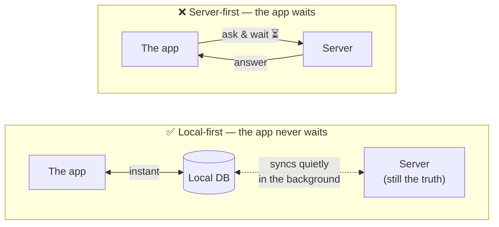
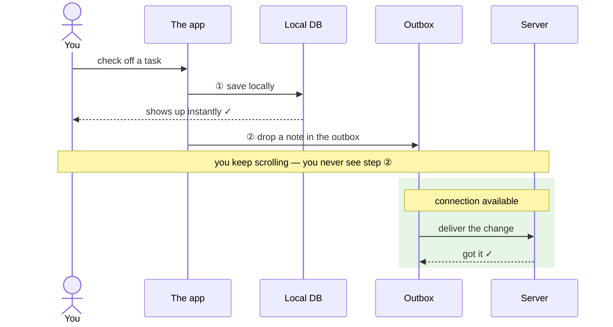
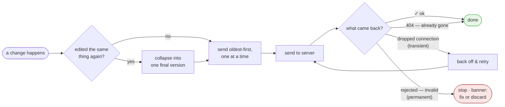
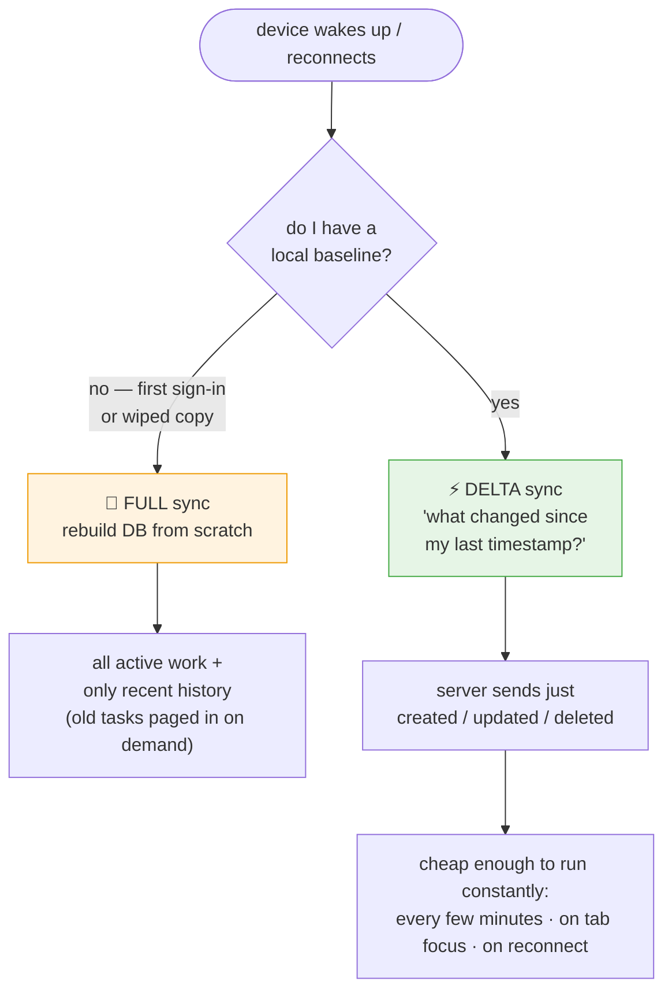
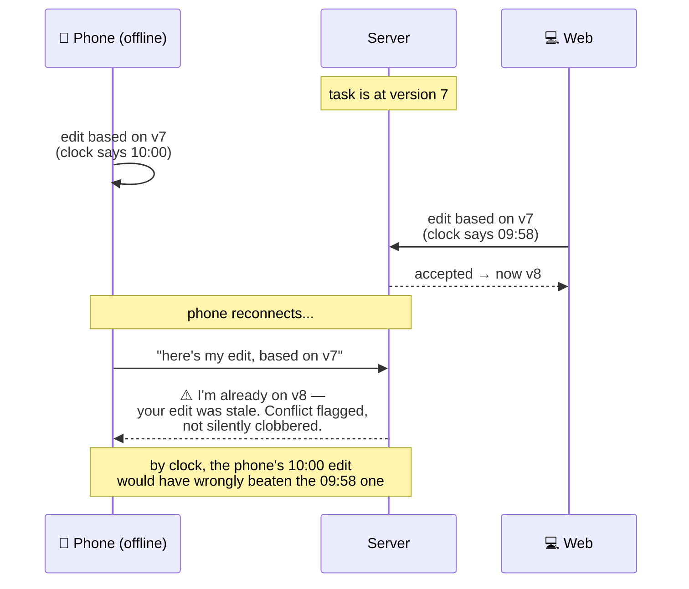
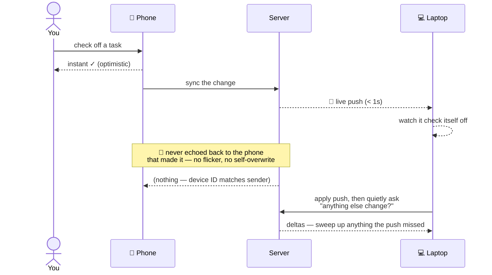

# How I Made My To-do List App Feel Instant — Even Offline

In the age of vibe coding, everyone builds a to-do app. I wanted one I'd actually trust with my day — fast, reliable, and unbothered when the WiFi drops. So I built [TodoPro](https://todopro.xyz). This post is how it feels instant, even offline — mostly in pictures.

---

## The one decision everything hangs on

Most apps ask the server a question and wait. The server is the truth; your screen is a temporary window into it. Network goes dark, window goes dark.

I flipped it. **Your device has its own database, and the screen only ever talks to that.** This is the **local-first** (or **offline-first**) architecture — the same idea behind apps like Linear and Figma.

The trade: two copies of your data that must agree. That's real complexity — and the whole rest of this post is the bill for it. Worth it every time.

---

## "Optimistic UI" is just trusting yourself

This pattern has a name — **optimistic UI** (or _optimistic updates_): you assume the write will succeed and show the result immediately, instead of waiting to confirm it. Check off a task and it checks off _now_ — no grey-out, no waiting for the server's blessing. Two things fire the instant you act, and you only ever see the first:

That outbox is a real, named design: the **outbox pattern** (a durable, persistent write queue). The note in the outbox survives a closed tab, a refresh, a laptop shut for two days. When a connection comes back, it wakes up and delivers everything in order. That's not elegance — it's _trust_. Once people learn the app never drops what they throw at it, they throw more at it. That's the whole game for a task manager.

### The outbox has opinions

My first outbox was dumb — a list of changes fired one by one — and it bred weird bugs. The current one has rules:

- **Merges spam (_coalescing_/_debouncing_)** — three typo-fixes in five seconds become one round-trip.
- **Respects order** — you can't label a task the server hasn't heard of yet. (Ordered, one-at-a-time delivery is what keeps writes causally consistent.)
- **Knows "try again" from "give up" (_retry with exponential backoff_)** — transient failures retry on a widening delay; a genuinely invalid change stops instead of jamming the queue forever (a _poison-message_ guard).
- **"Already gone" counts as success (_idempotency_)** — deleting a task another device already deleted returns 404, which is exactly the outcome you wanted. Treating retries as idempotent is what makes an at-least-once queue safe.

None of it is glamorous. All of it is the difference between _feeling_ reliable and only demoing well.

---

## The hard part isn't going offline. It's coming back.

Anyone can cache and show data offline. The hard problem is **reconciliation** (also called _sync_ or _convergence_): on reconnect, how do your changes and the server's changes agree on one truth? I use two moves — a **full sync** (bootstrap) and an incremental **delta sync**.

The reconnect trigger is the important one — it fires **both directions at once**: push my queued changes up, pull the world's changes down.

> **The tombstone rule.** _Tombstone_ is the standard term for a record that marks a row as deleted rather than removing it. When something is deleted, the record that it's _gone_ is the most important thing to sync. Hide deleted rows and two devices can never agree something was removed — the ghost keeps reappearing. So sync deliberately ships tombstones: _"this no longer exists"_ is data too.

### When two people edit the same thing

You edit a task on your phone offline; your teammate edits it on the web. Both valid. Who wins?

The tempting answer — "whoever saved last," known as **last-write-wins (LWW)** — is wrong, because _last_ depends on clocks, and clocks never agree:

So I don't use time — I use **version numbers** the server bumps on every change. This is **optimistic concurrency control (OCC)**, the same version-check-on-write that databases and HTTP `ETag`/`If-Match` use. An edit says "I'm on v7"; if the server's on v8, it knows the edit is stale. Same guard inbound: a change older than what the device already holds gets dropped, not applied. Versions are unambiguous in a way wall-clock time never is — and that's what keeps collaborative editing from quietly eating people's work.

---

## Making it feel alive across devices

Correctness isn't enough. If a task you complete on your phone takes five minutes to appear on your laptop, it feels _dead_ — technically synced, emotionally broken. So I keep a live WebSocket open while you're online — a **publish/subscribe** channel that pushes changes to every connected device:

Two choices made this feel right instead of janky:

- **Don't echo a change back to the device that made it (_echo suppression_ / _loopback prevention_).** It already showed you the result optimistically; bouncing it back causes flicker or overwrites your in-progress edit with an older copy of itself. Every device carries a stable ID, and the server won't send a change home to its sender. (Obvious in hindsight; cost me a couple of point releases and one maddening bug.)
- **Treat the live push as a hint, not gospel.** Connections drop and miss messages, so a push channel is _best-effort_ delivery, not guaranteed. After applying a push I schedule one of those little delta catch-ups a moment later — the delta sync is what makes the whole thing **eventually consistent**. **Push for the _feel_ of instant; pull for the _guarantee_ of correct.** Belt and suspenders — the user sees neither.

---

## Why I bothered

I could have built the easy way: ask the server, show a spinner, shrug when the WiFi's bad. Most apps do, and most apps are forgettable for exactly that reason.

Instead I bet that _never making you wait and never losing your stuff_ is worth the machinery underneath — the version numbers, the outbox that merges and retries and knows when to quit, the tombstones, the live-but-verified sync. You'll never think about any of it. That's the point.

Give [TodoPro](https://todopro.xyz) a try: open it, kill your WiFi, add a few tasks, watch it not care. Then turn WiFi back on and watch everything quietly show up on your other devices. That quiet is the whole product.

The milk gets remembered. That was always the goal.
