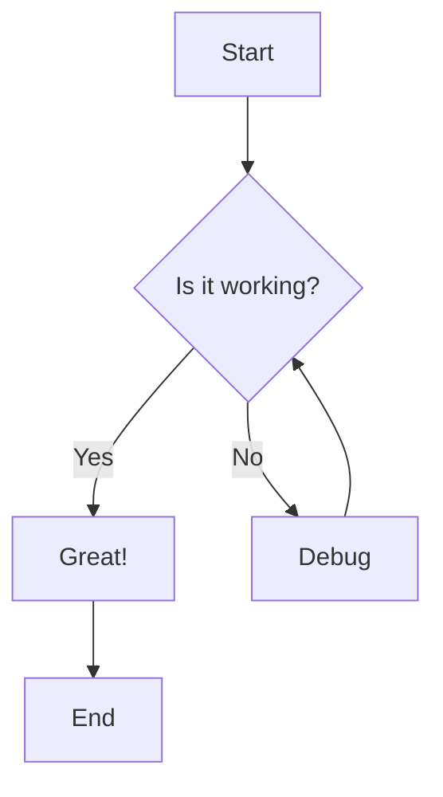
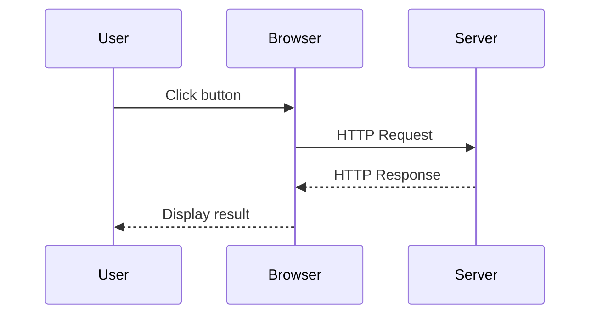
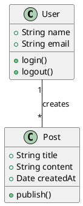
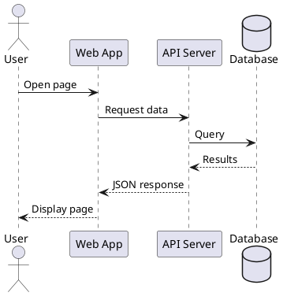

# Testing Diagram Support

This post tests both Mermaid and PlantUML diagram rendering.

## Mermaid Diagram

Here's a simple flowchart using Mermaid:

## Another Mermaid Example - Sequence Diagram

## PlantUML Diagram

Here's a simple class diagram using PlantUML:

## PlantUML Sequence Diagram

Both diagram types should render properly on the website!
