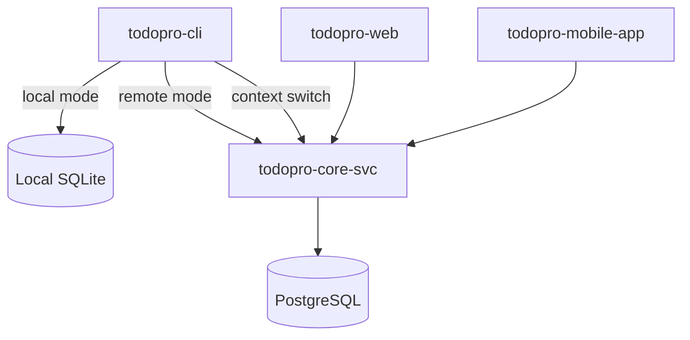

## Why I built this

Most task managers are either too simple (sticky notes with sync) or too heavy (Jira-in-your-pocket). I wanted something that:

- Works fast from the terminal without leaving the keyboard.
- Stores data locally by default, syncs remotely when needed.
- Doesn't compromise privacy — especially for work tasks.
- Supports the way I actually focus: timed sessions, not endless backlogs.

TodoPro started as a CLI tool and grew from there.

## What it is

TodoPro is a task management system with four main components:

```
todopro/
├── todopro-cli/       # Python CLI — the primary interface
├── todopro-web/       # Web UI
├── todopro-mobile-app/# Flutter mobile app
└── todopro-core-svc/  # Backend API service
```

Each component is independently usable. The CLI works fully offline. The backend enables sync and multi-device access when you opt in.

## Architecture



The core abstraction is a **repository interface** — the CLI doesn't know whether tasks are stored locally or remotely. Switching contexts (local → remote server) is a single command, not a settings page.

## CLI design

The CLI follows a verb-first, kubectl-style command structure:

```bash
# Create tasks
todopro add "Fix the auth bug" --due tomorrow --priority high

# Natural language
todopro add "remind me to review PRs every Monday morning"

# Focus mode — Pomodoro-style session
todopro focus start

# Context switching
todopro context use work-remote
```

The terminal UI is built with Rich, so output is readable without being flashy. Long lists, tag filtering, Eisenhower matrix views — all rendered in the terminal.

## Key features

### End-to-end encryption

Tasks can be encrypted before leaving the device. The key never leaves the client. The server stores ciphertext it cannot read — useful for anything sensitive.

The key hierarchy follows a standard envelope encryption pattern: a per-user master key wraps per-context data keys.

### Focus mode

Inspired by Pomodoro, but flexible:

- Configurable work/break intervals.
- Automatically links completed sessions to tasks.
- Analytics: streaks, session counts, time per tag, productivity trends.

It doesn't require a network connection — session data is local first, synced later.

### Ramble — voice to tasks

The most experimental feature: speak naturally, tasks appear automatically.

```
"I need to send the proposal to Alice by Friday and also remind me 
to check the CI pipeline before the release"
```

Ramble parses this into two structured tasks with due dates and assignees, using a local speech-to-text model and an LLM for intent extraction. No audio ever leaves the device.

### Geo-fencing contexts

You can configure contexts that activate automatically based on location — home context when you're at home, work context at the office. The CLI polls location on startup and switches contexts silently.

## What I learned

**Abstractions pay off late.** The repository interface felt like over-engineering at first. Six months in, adding a new storage backend (remote API) was a clean implementation rather than a refactor.

**Local-first is a UX statement.** Users don't think about sync; they think about latency. "Did my task save?" shouldn't require an internet connection.

**Voice input has a long tail.** Parsing natural speech into structured tasks works 80% of the time without much effort. The remaining 20% — ambiguous dates, implied context, multi-intent utterances — takes most of the engineering.

## Status

TodoPro is in active development. The CLI is the most mature component; the web and mobile apps are catching up. The backend is deployed on my homelab Kubernetes cluster via ArgoCD.
